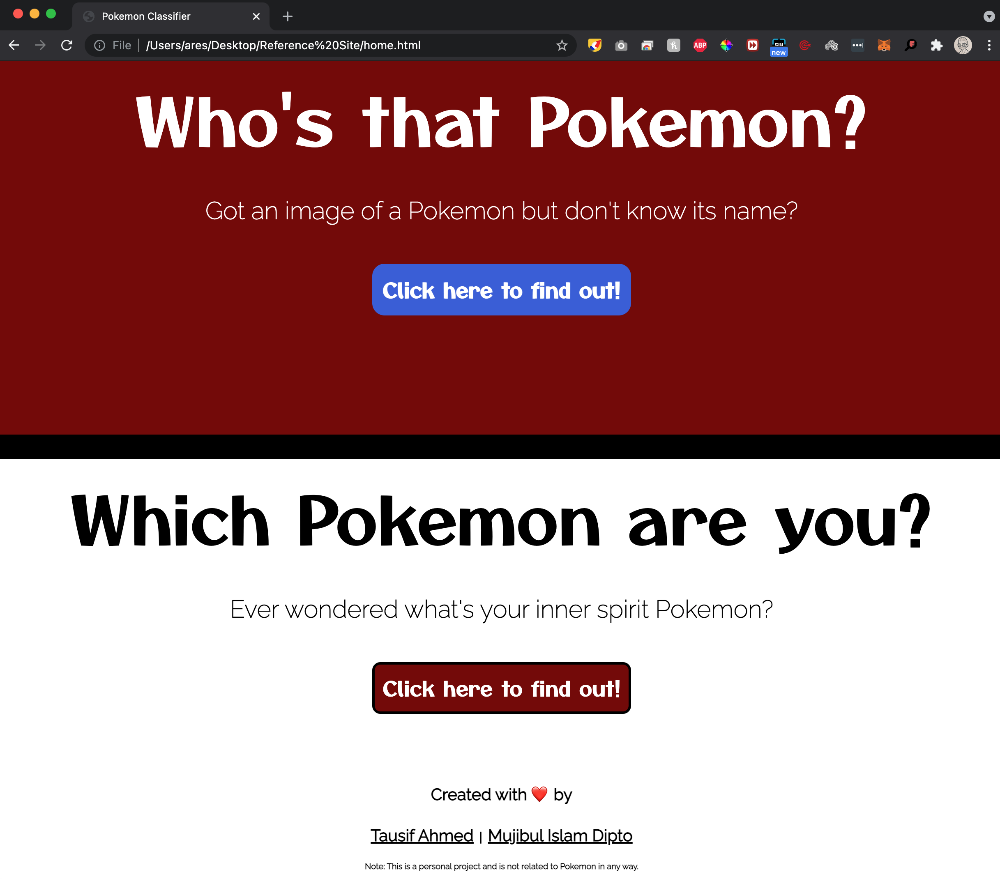
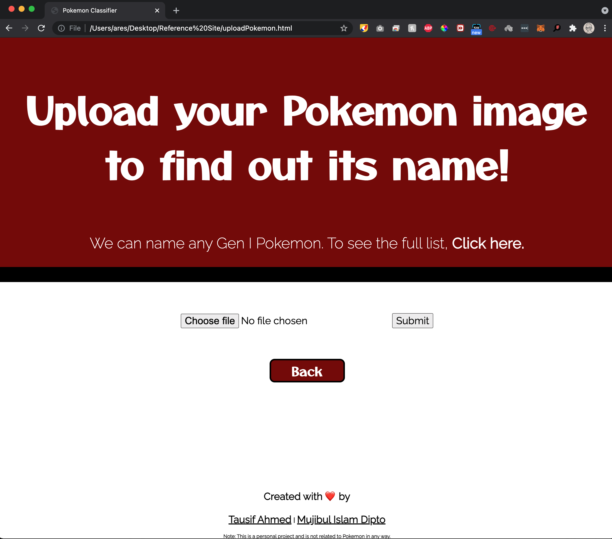
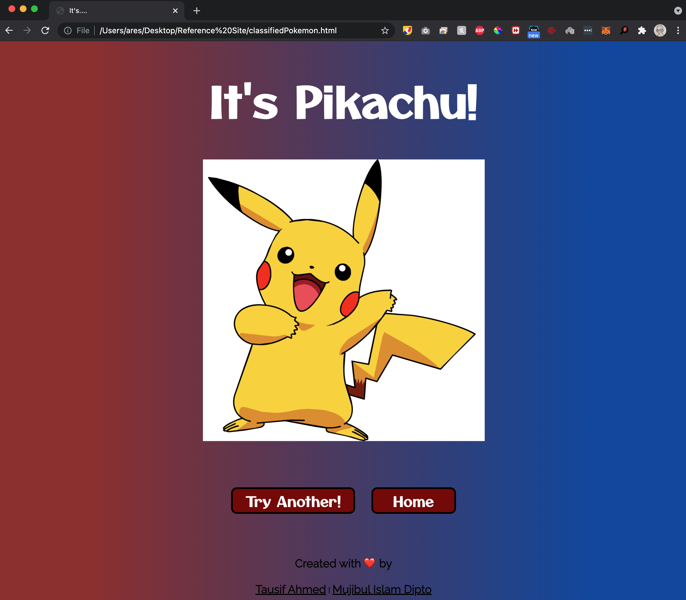
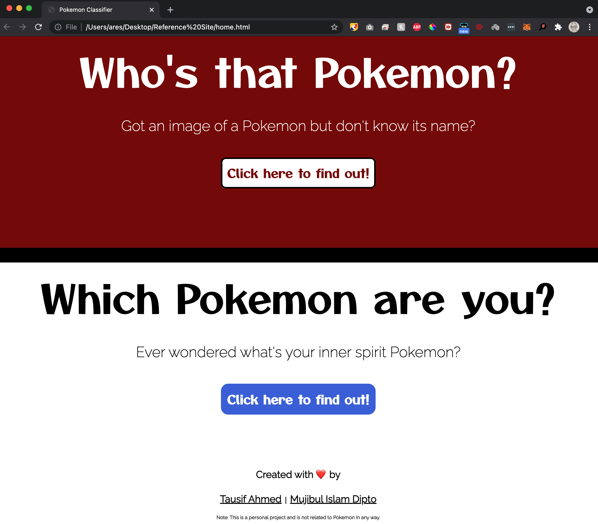
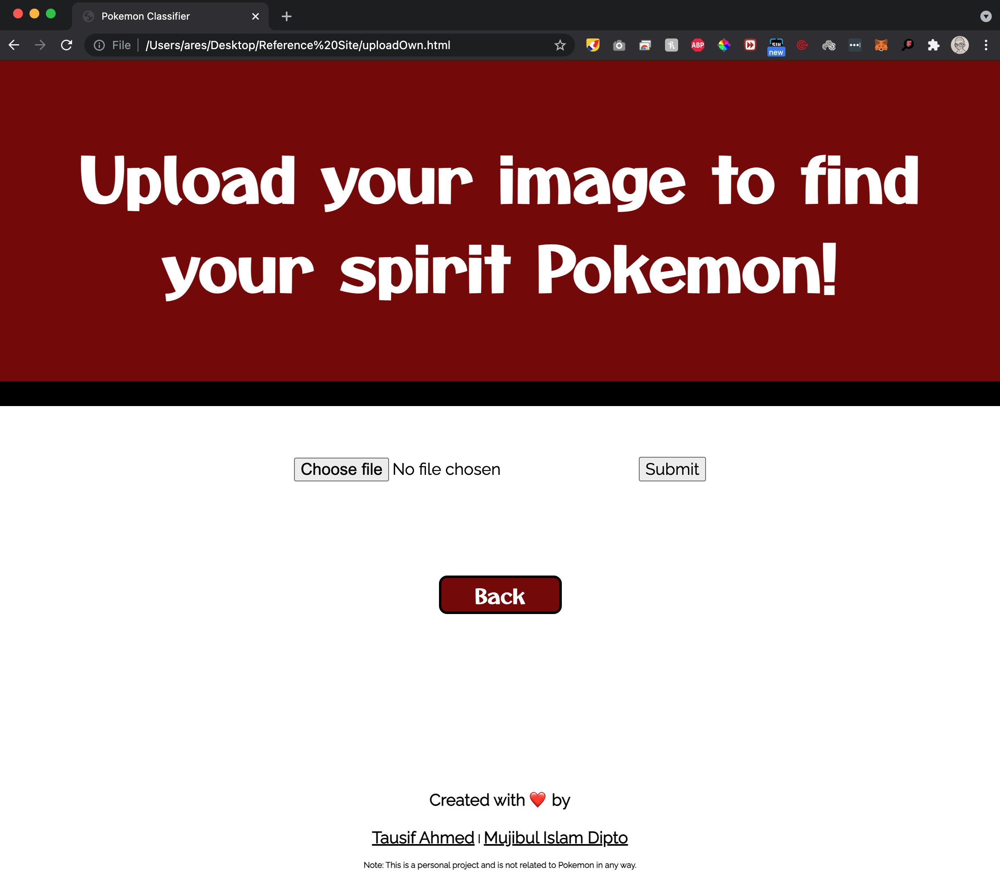
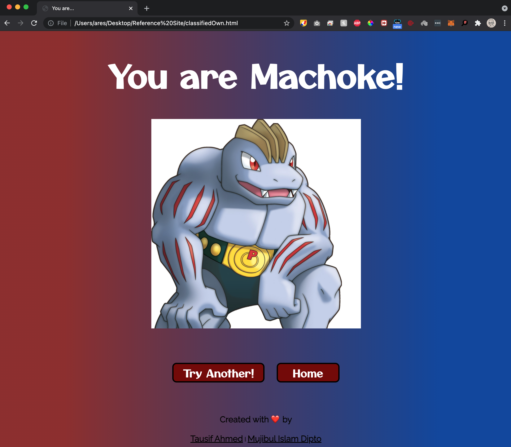

<!-- PROJECT LOGO -->
<br />
<p align="center">
  <a href="https://github.com/othneildrew/Best-README-Template">
    
  </a>

  <h3 align="center">Pokemon Classifier</h3>

  <p align="center">
    A Pokemon classifier capable of identifying any <a href="https://www.serebii.net/pokemon/gen1pokemon.shtml" target="_blank" </a> Gen I Pokemon. 
    <br />
    <!--- <a href="https://github.com/othneildrew/Best-README-Template"><strong>Explore the docs »</strong></a> --->
    <br />
    <br />
     <!--- <a href="https://github.com/othneildrew/Best-README-Template">View Demo</a>  --->
   <!--- ·  --->
   <!---   <a href="https://github.com/othneildrew/Best-README-Template/issues">Report Bug</a> --->
    <!--- ·  --->
    <a href="https://github.com/othneildrew/Best-README-Template/issues">Request Feature</a>
  </p>
</p>


<!-- TABLE OF CONTENTS -->
<details open="open">
  <summary>Table of Contents</summary>
  <ol>
    <li>
      <a href="#about-the-project">About The Project</a>
      <ul>
        <li><a href="#authors">Authors</a></li>
        <li><a href="#built-with">Built With</a></li>
      </ul>
    </li>
    <li>
      <a href="#getting-started">Getting Started</a>
      <ul>
        <li><a href="#installation">Installation</a></li>
      </ul>
    </li>
    <li><a href="#usage">Usage</a></li>
    <li><a href="#acknowledgements">Acknowledgements</a></li>
  </ol>
</details>


<!-- ABOUT THE PROJECT -->
## About The Project

### Authors
<a href="https://github.com/ahmedtausif5"> Tausif Ahmed </a>
</br>
<a href="https://github.com/MujiDipto"> Mujibul Islam Dipto </a>

### Built With

[TensorFlow](https://www.kaggle.com/lantian773030/pokemonclassification)


### Data From

[Kaggle](https://www.tensorflow.org/)

<!-- GETTING STARTED -->
## Getting Started

#### To test out the app visit:
http://pokemon-identifier.herokuapp.com/

#### To get a local copy up and running follow these simple steps:


### Installation

1. Clone the repo
   ```sh
   git clone https://github.com/MujiDipto/pokemon-classifier.git
   ```
2. Install anaconda

   Visit https://www.anaconda.com/download/

3. Create a conda environment
    ```sh
   conda create -n [ENVIRONMENT_NAME]
   ```
4. Use [requirements] to automatically load all dependencies.
    ```sh
   pip install -r requirements.txt
   ```
5. Run [app.py]
    ```sh
   python app.py
   ```


### Usage

The app contains two main functionalities:

#### Identify the name of a Pokemon given its image.

The underlying Convolutional neural Network (CNN) model has been trained with thousands of Pokemon image data. It can identify "features" from the given Pokemon image and identify its name with a 94% accuracy.

#### Find your inner Pokemon.

Here, the CNN model is used to analyse features of a given user's photo (their own image) and identify the Pokemon that most closely resembles them. Thus, rather than randomly selecting a Pokemon, our model can use its knowledge to determine the user's inner Pokemon!

<!-- USAGE EXAMPLES -->
<details open="open">
<summary> Example Screenshots </summary>

### Classify a Pokemon
1. Click on the "Click here to find out!" button under "Who's that Pokemon?"



2. Browse and select the image of the Pokemon you want to identify



3. And Voila!




### Find out which Pokemon you are

1. Click on the "Click here to find out!" button under "Which Pokemon are you?"



2. Browse and select a photo of you



3. Congrats! You just found your inner spirit Pokemon!


</details>


<!-- ACKNOWLEDGEMENTS -->
## Acknowledgements
* [DeepLizard](https://deeplizard.com/learn/playlist/PLZbbT5o_s2xrwRnXk_yCPtnqqo4_u2YGL)
* [Kaggle](https://www.kaggle.com/lantian773030/pokemonclassification)
* [Best-README-Template](https://github.com/othneildrew/Best-README-Template)


<!-- MARKDOWN LINKS & IMAGES -->
<!-- https://www.markdownguide.org/basic-syntax/#reference-style-links -->
[contributors-shield]: https://img.shields.io/github/contributors/othneildrew/Best-README-Template.svg?style=for-the-badge
[contributors-url]: https://github.com/othneildrew/Best-README-Template/graphs/contributors
[forks-shield]: https://img.shields.io/github/forks/othneildrew/Best-README-Template.svg?style=for-the-badge
[forks-url]: https://github.com/othneildrew/Best-README-Template/network/members
[stars-shield]: https://img.shields.io/github/stars/othneildrew/Best-README-Template.svg?style=for-the-badge
[stars-url]: https://github.com/othneildrew/Best-README-Template/stargazers
[issues-shield]: https://img.shields.io/github/issues/othneildrew/Best-README-Template.svg?style=for-the-badge
[issues-url]: https://github.com/othneildrew/Best-README-Template/issues
[license-shield]: https://img.shields.io/github/license/othneildrew/Best-README-Template.svg?style=for-the-badge
[license-url]: https://github.com/othneildrew/Best-README-Template/blob/master/LICENSE.txt
[linkedin-shield]: https://img.shields.io/badge/-LinkedIn-black.svg?style=for-the-badge&logo=linkedin&colorB=555
[linkedin-url]: https://linkedin.com/in/othneildrew
[product-screenshot]: screenshots/product.png
[requirements]: requirements.txt
[app.py]: app.py
